# Resystems Task Graph

`task-graph` reads GitHub `[tasklist]`s to render a graph view of your issues.

Currently the main rendering format for task graphs is as Mermaid flow charts.
These flow charts can then viewed via static HTML, or simply pasted back into
GitHub issues in order to help with task management and planning.

## Task Lists

Note GitHub task-lists are still a [beta][github-tasklists] feature.

However, task-lists can still be added to issues, even if you do have access to
the beta, feature by simply including the fenced `[tasklist]` section e.g.

````
```[tasklist]
- [ ] resystems-io/architecture#1
- [ ] resystems-io/task-graph#1
```
````

## Example

In order to create a "fenced" mermaid task graph starting at:

- `resystems-io/architecture#1`

the following can be executed:

- `task-graph -v -o resystems-io -r architecture -n 8 mermaid -f`

```mermaid
---
title: Task Graph
---

flowchart

subgraph Tasks

        direction TB

        subgraph task-graph

                tg0100["Example Release"]
                click tg0100 href "https://github.com/resystems-io/task-graph/issues/1" "Open resystems-io/task-graph#1"

                tg0101["Example Subtask Two"]
                click tg0101 href "https://github.com/resystems-io/task-graph/issues/5" "Open resystems-io/task-graph#5"

                tg0102["Example Feature One"]
                click tg0102 href "https://github.com/resystems-io/task-graph/issues/2" "Open resystems-io/task-graph#2"

                tg0103["Example Feature Two"]
                click tg0103 href "https://github.com/resystems-io/task-graph/issues/3" "Open resystems-io/task-graph#3"

                tg0104["Example Subtask One"]
                click tg0104 href "https://github.com/resystems-io/task-graph/issues/4" "Open resystems-io/task-graph#4"


        end

        subgraph architecture

                tg0105["Example Task-Graph Tracking"]
                click tg0105 href "https://github.com/resystems-io/architecture/issues/8" "Open resystems-io/architecture#8"


        end
                tg0105 --> tg0100
                tg0100 --> tg0102
                tg0100 --> tg0103
                tg0103 --> tg0104
                tg0103 --> tg0101

end

classDef tasks fill:#fff
classDef projects fill:#eed

classDef closed fill:#ccc
classDef abandoned fill:#222222
classDef completed fill:#37e519
classDef review fill:#f55a00
classDef active fill:#e5b104
classDef parked fill:#b37fcd
classDef pending fill:#60a1ea
classDef staged fill:#f07ee9

class Tasks tasks;

```



To create a local HTML file that can be viewed one can instead run:

```sh
task-graph -v -o resystems-io -r architecture -n 8 mermaid -b > tg-8.html
firefox tg-8.html
```

## Install

```sh
go install go.resystems.io/task-graph/cmd/task-graph@latest
task-graph help
```

You will also need to provide a copy of a valid GitHub access token:

```sh
mkdir -p ~/.config/task-graph
echo "ghp_..." > ~/.config/task-graph/github_access_token
```

## Take note of rate limiting

Note, if you have a very large connected graph of issues, running `task-graph`
may result in many separate calls to GitHub. In this case consider using the
`-c` option to avoid traversing closed issues, and be aware of:

- [GitHub API rate limiting][github-rate-limiting]

[github-rate-limiting]:https://docs.github.com/en/rest/overview/resources-in-the-rest-api?apiVersion=2022-11-28#rate-limiting "GitHub API Rate Limiting"
[github-tasklists]:https://docs.github.com/en/issues/tracking-your-work-with-issues/about-tasklists "About GitHub Task Lists"
